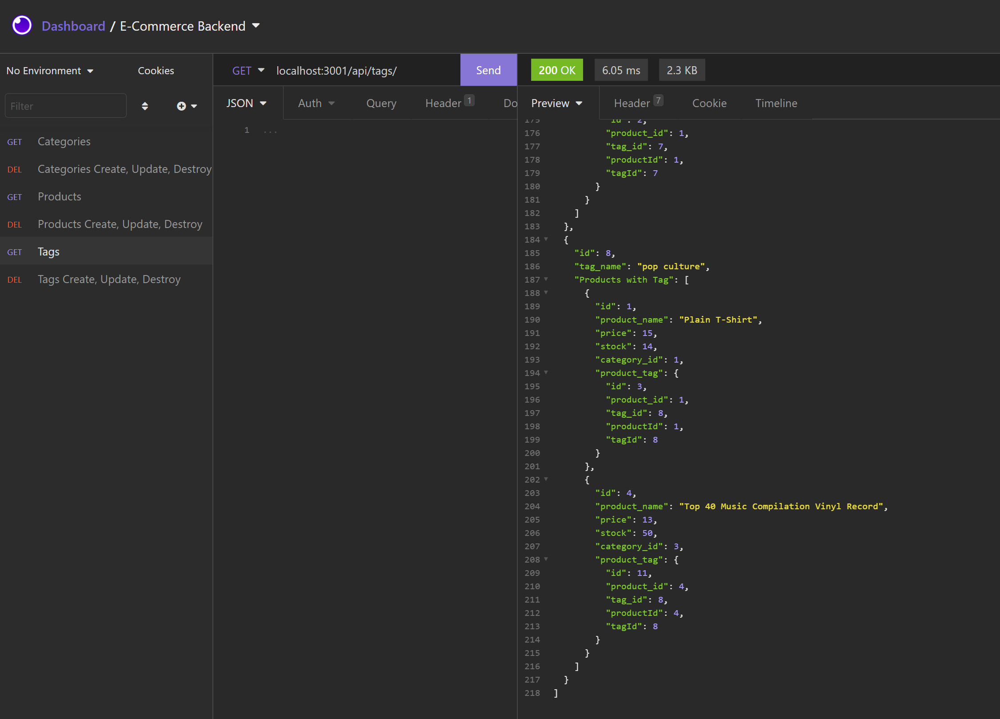

# E-Commerce Backend
[](https://opensource.org/licenses/MIT)

## Description

A mock database strucutre with editing capabilities using node, express and mysql.

[Link To The Walk Through Video](https://drive.google.com/file/d/1yNrxV9UzUTySx4zgvpsuQHnr3vqMOktn/view?usp=sharing)

[](https://drive.google.com/file/d/1yNrxV9UzUTySx4zgvpsuQHnr3vqMOktn/view?usp=sharing)

  ## Table Of Contents

* [Installation](#!installation)

* [Usage](#usage)

* [License](#license)

* [Contributing](#contributing)

* [Tests](#tests)

* [Questions](#questions)

================================================

## Installation

To install the necessary dependencies, please run the following command:

```
npm i
```

================================================

## Usage

Make sure there is an env file for your sql login credentials.

================================================

## License

This project is licensed under the MIT license.

================================================

## Contributing

nada

================================================

## Tests

To test if the dependencies are all installed, please run the following command:

```
npm test
```

================================================

## Questions

If you have any questions please reach out to me [HERE](mailto:joshwatkinssfs@gmail.com). You can find more of my work at [MY GITHUB](https://www.github.com/joshuakwatkins/).


